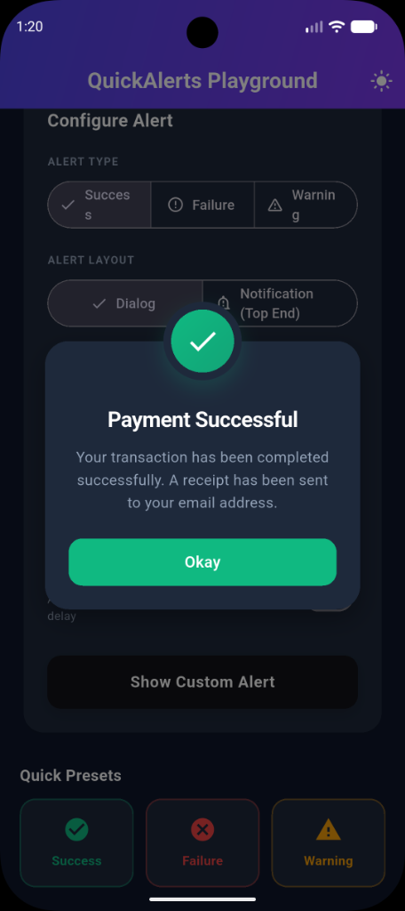
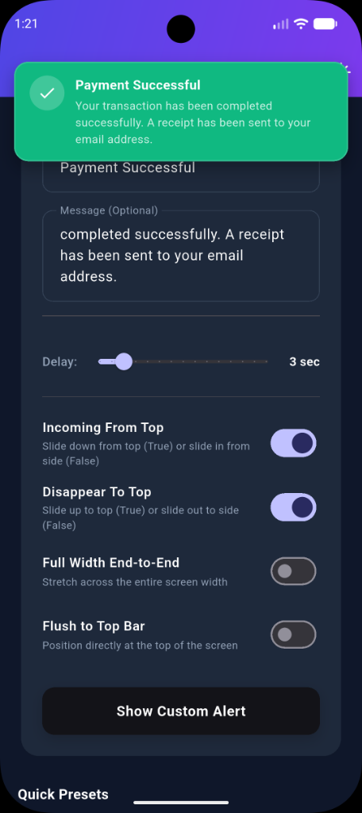
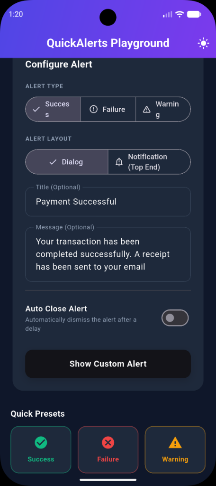
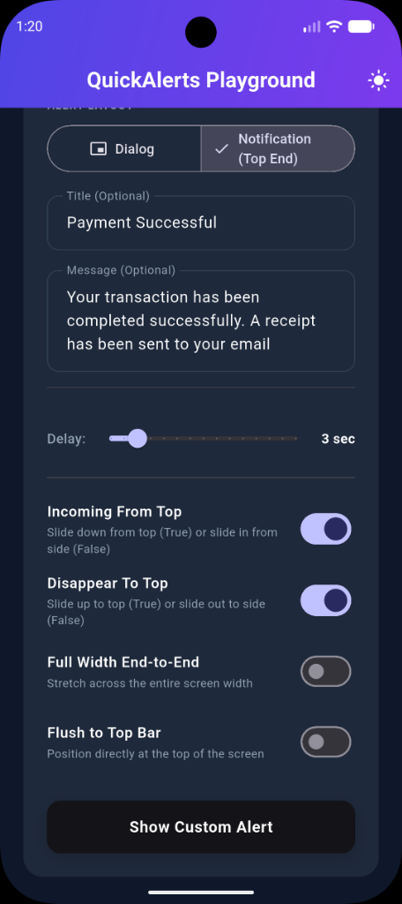

# QuickAlerts

A premium, highly customizable, and responsive in-app alert dialog and top-end floating notification toast system for Flutter applications.

Designed with sleek aesthetics, fluid entrance/exit animations, full support for adaptive light and dark modes, and mobile notch (safe area) awareness.

---

## Preview

| Traditional Modal Dialog | Vibrant Top-End Notification Toast |
| :---: | :---: |
|  |  |

| Dialog Configuration Playground | Notification Configuration Playground |
| :---: | :---: |
|  |  |

---

## Features

- **Alert Layouts**: 
  - `QuickAlertLayout.dialog`: Standard premium dialog card layout.
  - `QuickAlertLayout.notification`: Floating top notification banner that auto-adjusts to status bars/notches.
- **Alert Types**: Supports `QuickAlertType.success`, `QuickAlertType.failure`, and `QuickAlertType.warning` with matching icons and default themes.
- **Adaptive Dark Mode**: Fully responsive theme colors for light/dark settings.
- **Entrance & Exit Easing Animations**: Smooth slide-in with bounce backing curves and slide-out exits.
- **Gesture Control**: Fully swipable dismissal support (`DismissDirection.up`) for notifications.
- **Custom Positioning & Sizing**:
  - `fullWidth`: Stretch notifications end-to-end to take up 100% of screen width.
  - `flushToTop`: Anchor notifications flat against the top edge of the screen, automatically padded to protect status bar texts.
  - `incomingFromTop` / `disappearToTop`: Configure if the banner slides in/out from the top edge or horizontally from the side.
- **Auto-Dismiss Timers**: Configurable durations (defaults to 3 seconds for notifications and respects manual overrides).

---

## Installation

Add `quick_app_alert` to your `pubspec.yaml` file:

```yaml
dependencies:
  quick_app_alert: ^1.0.0
```

Run command:
```bash
flutter pub get
```

---

## Usage

Import the package in your Dart code:
```dart
import 'package:quick_app_alert/quick_app_alert.dart';
```

### 1. Show Standard Alert Dialog
```dart
QuickAlert.show(
  context: context,
  type: QuickAlertType.success,
  title: 'Success',
  text: 'Your action completed successfully!',
);
```

### 2. Show Colored Top-End Floating Notification
```dart
QuickAlert.show(
  context: context,
  type: QuickAlertType.success,
  title: 'Payment Complete',
  text: 'A receipt has been sent to your email.',
  layout: QuickAlertLayout.notification, // Change layout to notification
);
```

### 3. Customize Animations and Layout Geometry
```dart
QuickAlert.show(
  context: context,
  type: QuickAlertType.warning,
  title: 'Warning',
  text: 'Review changes before proceeding.',
  layout: QuickAlertLayout.notification,
  incomingFromTop: false,  // Slides in horizontally from side
  disappearToTop: false,   // Slides out horizontally to side
  fullWidth: true,         // Stretch banner end-to-end across the screen
  flushToTop: true,        // Pin flat at top (auto-padded for safe notches)
);
```

---

## Configuration Properties

| Property | Type | Default Value | Description |
| :--- | :--- | :--- | :--- |
| `context` | `BuildContext` | *Required* | BuildContext used to overlay the alerts. |
| `type` | `QuickAlertType` | *Required* | Type of alert: `success`, `failure`, or `warning`. |
| `title` | `String?` | Standard for type | Main title text. Falls back to standard type header if null. |
| `text` | `String?` | `null` | Secondary description or body message text. |
| `confirmBtnColor` | `Color?` | Theme default for type | Color of confirmation button or notification background. |
| `confirmBtnText` | `String` | `'OK'` | Primary action button text (ignored in notification mode). |
| `onConfirmBtnTap` | `VoidCallback?` | `null` | Callback executed when user taps button or notification closes. |
| `autoClose` | `bool?` | `true` (notification) / `false` (dialog) | Force dismisses the alert after the timer completes. |
| `autoCloseDuration` | `Duration?` | `3s` (notification) / `5s` (dialog) | Timer timeline duration before closing. |
| `layout` | `QuickAlertLayout` | `QuickAlertLayout.dialog` | Choice between `dialog` and `notification` layouts. |
| `incomingFromTop` | `bool` | `true` | Slide in from top (`true`) or slide in horizontally from the side (`false`). |
| `disappearToTop` | `bool` | `true` | Slide out to top (`true`) or slide out horizontally to the side (`false`). |
| `fullWidth` | `bool` | `false` | Stretches notification banner 100% width horizontally. |
| `flushToTop` | `bool` | `false` | Pin notification flat at top edge of the screen. |
